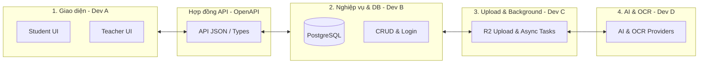

# Kế hoạch Phân rã Hệ thống & Nguyên tắc Thiết kế Tối thiểu - Scope Học sinh tự nộp bài

Tài liệu này xác định phương án chia tách module để **các thành viên phát triển độc lập không bị chồng chéo**, cách **trừu tượng hóa (abstract) OCR/AI** và các **nguyên tắc thiết kế tối thiểu (Minimum Design Principles)** cho phạm vi học sinh tự nộp bài tập về nhà.

---

## 1. Trừu tượng hóa OCR & AI Model (Service Abstraction)

Các kỹ sư xây dựng backend và frontend không cần đợi kết quả của kỹ sư AI. Logic AI/OCR sẽ được trừu tượng hóa qua hai Interface:

1. **`OCRService` Interface:**
   * Method: `async def extract_text(file_bytes: bytes) -> OCRResult`
   * Trả về chuỗi text bóc tách từ ảnh bài tập viết tay của học sinh.
2. **`GradingService` Interface:**
   * Method: `async def grade_submission(student_text: str, rubric: RubricData, answer_key: str) -> GradingResult`
   * So khớp bài làm với đáp án và rubric để sinh điểm đề xuất + nhận xét thô.

Trong thời gian phát triển, Backend sử dụng các **Mock Service** để phản hồi dữ liệu giả lập ngay lập tức, cho phép Frontend test UI nộp bài và xem điểm của học sinh trước khi tích hợp API thực tế từ nhà cung cấp OCR/AI.

---

## 2. Phân chia công việc thành viên (Không chồng chéo)

Chúng ta chia dự án thành **4 phân khu độc lập** kết nối với nhau bằng các **Hợp đồng kỹ thuật (Contracts)**.

### Kế hoạch phân vai & Phân rã Module:

| Thành viên | Nhiệm vụ chính | Điểm chạm cần tránh chồng chéo | Giải pháp giải quyết |
| :--- | :--- | :--- | :--- |
| **Dev A (Frontend)** | • Làm màn hình học sinh: nhập mã lớp, nộp ảnh bài tập, xem kết quả. • Làm màn hình giáo viên: tạo bài tập kèm rubric, xem danh sách nộp bài, duyệt điểm. | Cần dữ liệu từ API để hiển thị giao diện. | Sử dụng **API Mock** dựa trên file Spec đã thống nhất từ trước. |
| **Dev B (Core Backend)** | • Thiết kế DB Schema PostgreSQL (Classrooms, Assignments, Submissions, Grades). • Viết API CRUD cho học sinh tham gia lớp học, nộp bài, giáo viên quản lý bài tập và duyệt điểm. | Cần lưu kết quả chấm bài từ tác vụ chạy ngầm. | Định nghĩa rõ cấu trúc bảng `SUBMISSIONS` và `GRADES`. Chỉ cần cung cấp hàm API nội bộ để cập nhật trạng thái chấm bài. |
| **Dev C (Infrastructure)** | • Cấu hình upload trực tiếp từ client lên Cloudflare R2 qua Presigned URL. • Thiết lập FastAPI `BackgroundTasks` để kích hoạt luồng chấm AI ngầm. • Viết API Polling/SSE để thông báo trạng thái chấm bài cho Frontend. | Cần gọi logic AI và OCR để xử lý bài thi. | Dev C chỉ gọi Interface `OCRService` và `GradingService`. Dev C **không quan tâm** bên trong AI dùng mô hình gì, chỉ nhận dữ liệu trả về và cập nhật DB. |
| **Dev D (AI / Data Engineer)** | • Tối ưu prompt cho AI Model Provider chấm bài theo tiêu chí Rubric. • Kết nối API của nhà cung cấp dịch vụ OCR. • Viết module bóc tách JSON trả về từ LLM để map vào database. | Sợ làm ảnh hưởng trực tiếp đến hệ thống đang chạy. | Dev D làm việc hoàn toàn trong thư mục `src/services/providers/`. Viết Unit Test độc lập cho module prompt và OCR của mình mà không cần chạy toàn bộ server. |

---

## 3. Nguyên tắc Thiết kế Tối thiểu (Minimum Design Principles)

Trước khi viết bất kỳ dòng code nào, đội ngũ phải tuân thủ 5 nguyên tắc "Minimum" dưới đây:

1. **API-First & Contract-First:** Viết tài liệu API trước khi viết code backend hoặc frontend.
2. **Interface-Driven Development (IDD):** Mọi dịch vụ bên ngoài (OCR, LLM, Cloud Storage) đều phải khai báo Interface để viết bản Mock chạy thử nghiệm nhanh.
3. **YAGNI (Chưa cần thì chưa làm):** Tập trung đúng vào luồng nộp bài tập về nhà của học sinh. *Chưa làm:* hệ thống điểm danh, chat thời gian thực, tự host OCR riêng.
4. **Database-Driven Domain:** Chốt thiết kế cơ sở dữ liệu và kiểu dữ liệu (đặc biệt là cột JSONB lưu điểm chi tiết) trước khi viết code API để tránh migration dữ liệu diện rộng về sau.
5. **Stateless API & Queued Processing:** Các tác vụ tốn thời gian như OCR và chấm điểm AI không được chạy trực tiếp trên luồng API request. Phải đẩy vào FastAPI `BackgroundTasks` để phản hồi phản hồi ngay lập tức cho client dưới 500ms.
