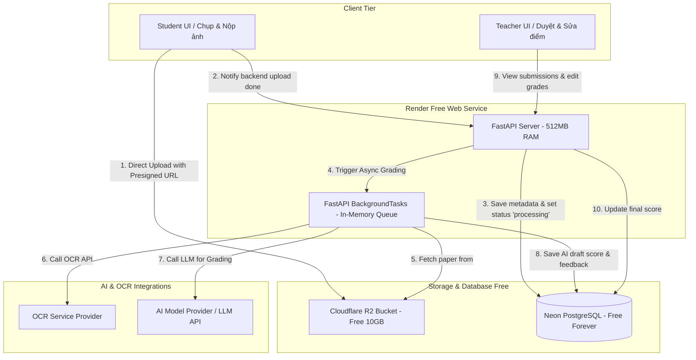
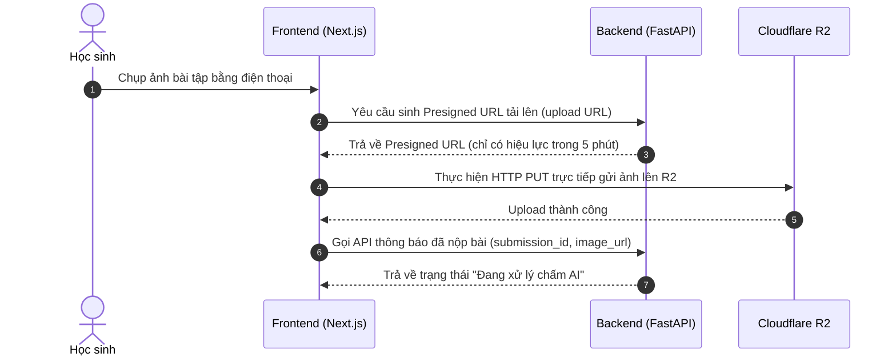

# Tài liệu Kiến trúc Hệ thống (System Architecture) - Cấu hình Render Free Tier

Dự án **AI Grading Copilot** được thiết kế theo cấu trúc **Monorepo** và tối ưu hóa để vận hành **100% miễn phí (Free Tier)** trên Render. 

Tài liệu này tập trung vào phạm vi (scope) mới: **Học sinh tự chụp ảnh và nộp bài tập về nhà (Homework), AI tự động OCR và đề xuất điểm thô, Giáo viên duyệt và chốt kết quả.**

---

## 1. Sơ đồ Kiến trúc luồng nộp bài tự động (Student-Facing Architecture)

Vì Render Free Web Service giới hạn tài nguyên (512MB RAM, CPU dùng chung) và tự động ngủ sau 15 phút không hoạt động, hệ thống loại bỏ hoàn toàn background worker phức tạp để tiết kiệm RAM. 

Thay vào đó, các tác vụ bất đồng bộ (OCR & AI Grading) được xử lý bằng **FastAPI native `BackgroundTasks`** chạy trên cùng một tiến trình API.



---

## 2. Bố cục Cấu trúc Thư mục Monorepo

Cả Frontend và Backend nằm chung trong một repository, phân chia rõ giao diện cho Học sinh (Student) và Giáo viên (Teacher). Thư mục chứa các service tích hợp OCR và AI được viết tổng quát để có thể tích hợp bất cứ nhà cung cấp nào:

```text
grading-copilot/ (Monorepo Root)
├── backend/                  # FastAPI Application
│   ├── src/
│   │   ├── api/              # Endpoints (v1/auth.py, v1/assignments.py, v1/submissions.py)
│   │   ├── core/             # config.py, database.py, security.py
│   │   ├── models/           # SQLAlchemy models
│   │   ├── schemas/          # Pydantic schemas
│   │   ├── services/         # OCR, Grading, Storage
│   │   │   ├── ocr/
│   │   │   │   ├── base.py   # Abstract OCR class
│   │   │   │   ├── provider.py # OCR Provider implementation
│   │   │   │   └── mock.py   # Mock OCR service
│   │   │   ├── grading/
│   │   │   │   ├── base.py   # Abstract AI Grading class
│   │   │   │   ├── provider.py # AI Grading Provider implementation
│   │   │   │   └── mock.py   # Mock Grading service
│   │   │   └── storage.py    # Cloudflare R2 presigned url service
│   │   └── main.py           # FastAPI entry point
│   ├── requirements.txt
│   └── Dockerfile
├── frontend/                 # Next.js Application
│   ├── src/
│   │   ├── app/
│   │   │   ├── login/        # Đăng nhập chung
│   │   │   ├── student/      # Giao diện học sinh: chụp ảnh, nộp bài, xem điểm
│   │   │   │   ├── dashboard/
│   │   │   │   └── upload/
│   │   │   └── teacher/      # Giao diện giáo viên: tạo bài tập, duyệt bài, thống kê
│   │   │       ├── dashboard/
│   │   │       └── review/   # Chấm bài side-by-side
│   │   ├── components/
│   │   └── lib/
│   ├── package.json
│   └── next.config.js
└── README.md
```

---

## 3. Quy trình Upload trực tiếp & Bảo mật cho Học sinh

Để tránh việc học sinh tải ảnh dung lượng lớn làm tràn bộ nhớ (512MB RAM) của Render API, ảnh bài tập được tải trực tiếp lên Cloudflare R2:



---

## 4. Quy trình chấm AI bất đồng bộ (FastAPI BackgroundTasks)

Khi học sinh nộp bài thành công, hệ thống không bắt học sinh chờ AI chấm xong. API sẽ lưu trạng thái là `ocr_processing`, kích hoạt luồng xử lý ngầm và lập tức trả phản hồi `HTTP 202 Accepted` về màn hình của học sinh.

```python
# Ví dụ triển khai BackgroundTasks trong src/api/v1/submissions.py
from fastapi import APIRouter, BackgroundTasks, Depends
from src.services.grading.base import GradingService

router = APIRouter()

async def run_grading_pipeline(submission_id: str):
    # 1. Gọi OCR Service lấy text từ ảnh bài tập của học sinh
    # 2. Gửi text OCR + Ảnh gốc + Rubric của bài tập cho AI Grading Service
    # 3. Lưu kết quả chấm điểm thô và lời phê AI vào bảng `grades`
    # 4. Cập nhật trạng thái submission thành `graded`
    ...

@router.post("/submissions/{submission_id}/submit")
async def student_submit_homework(submission_id: str, background_tasks: BackgroundTasks):
    background_tasks.add_task(run_grading_pipeline, submission_id)
    return {"status": "processing", "message": "Bài làm đã được nộp thành công và đang được chấm tự động"}
```

* **Cập nhật tiến độ:** 
  * Giao diện Học sinh sẽ hiển thị trạng thái *"Đã nộp - Chờ giáo viên duyệt"*.
  * Giao diện Giáo viên sẽ hiển thị danh sách bài nộp của lớp, kèm theo cờ thông báo những bài đã chấm xong bởi AI và sẵn sàng để duyệt (`graded`).
