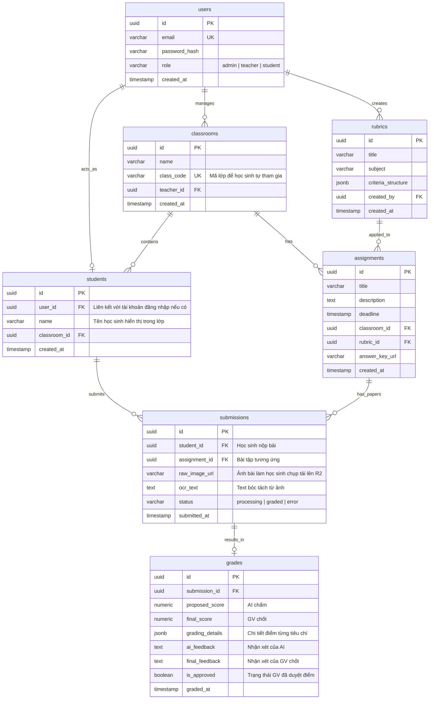

# Thiết kế Cơ sở Dữ liệu (Database ERD & Schema Design) - Scope Học sinh tự nộp bài

Hệ thống sử dụng cơ sở dữ liệu **PostgreSQL** để lưu trữ các quan hệ dữ liệu chặt chẽ và tận dụng kiểu dữ liệu `JSONB` để xử lý các tiêu chí rubric chấm điểm động.

---

## 1. Sơ đồ Quan hệ Thực thể (ERD Diagram)

---

## 2. Chi tiết Định nghĩa các Bảng (Table Schema)

### Bảng 1: `users`
Tài khoản đăng nhập của Giáo viên, Admin và Học sinh.

| Tên trường | Kiểu dữ liệu | Ràng buộc | Mô tả |
| :--- | :--- | :--- | :--- |
| `id` | `UUID` | PRIMARY KEY, Default: `gen_random_uuid()` | Định danh duy nhất |
| `email` | `VARCHAR(255)` | UNIQUE, NOT NULL | Địa chỉ email đăng nhập |
| `password_hash` | `VARCHAR(255)` | NOT NULL | Mật khẩu băm |
| `role` | `VARCHAR(50)` | NOT NULL | Vai trò: `admin`, `teacher`, `student` |
| `created_at` | `TIMESTAMP` | NOT NULL, Default: `NOW()` | Thời gian tạo tài khoản |

### Bảng 2: `classrooms`
Lớp học do Giáo viên quản lý, có mã lớp để học sinh tự đăng ký tham gia.

| Tên trường | Kiểu dữ liệu | Ràng buộc | Mô tả |
| :--- | :--- | :--- | :--- |
| `id` | `UUID` | PRIMARY KEY, Default: `gen_random_uuid()` | Định danh lớp |
| `name` | `VARCHAR(255)` | NOT NULL | Tên lớp (vd: Lớp 8A1) |
| `class_code` | `VARCHAR(50)` | UNIQUE, NOT NULL | Mã lớp để HS nhập khi tham gia lớp |
| `teacher_id` | `UUID` | FOREIGN KEY -> `users(id)` | Giáo viên chủ nhiệm/quản lý |
| `created_at` | `TIMESTAMP` | NOT NULL, Default: `NOW()` | Thời gian tạo |

### Bảng 3: `assignments` (Bài tập về nhà)
Bài tập giáo viên giao cho lớp học.

| Tên trường | Kiểu dữ liệu | Ràng buộc | Mô tả |
| :--- | :--- | :--- | :--- |
| `id` | `UUID` | PRIMARY KEY, Default: `gen_random_uuid()` | Định danh bài tập |
| `title` | `VARCHAR(255)` | NOT NULL | Tên bài tập (vd: Bài tập Tự luận Văn số 1) |
| `description` | `TEXT` | NULLABLE | Mô tả yêu cầu bài tập |
| `deadline` | `TIMESTAMP` | NOT NULL | Hạn chót nộp bài |
| `classroom_id` | `UUID` | FOREIGN KEY -> `classrooms(id)` | Thuộc lớp học nào |
| `rubric_id` | `UUID` | FOREIGN KEY -> `rubrics(id)` | Rubric chấm điểm áp dụng |
| `answer_key_url` | `VARCHAR(512)` | NULLABLE | File đáp án (nếu có) để AI đối chiếu |
| `created_at` | `TIMESTAMP` | NOT NULL, Default: `NOW()` | Thời gian tạo bài tập |

### Bảng 4: `submissions` (Bài nộp của học sinh)
Lưu trữ thông tin bài nộp do học sinh tự tải ảnh lên.

| Tên trường | Kiểu dữ liệu | Ràng buộc | Mô tả |
| :--- | :--- | :--- | :--- |
| `id` | `UUID` | PRIMARY KEY, Default: `gen_random_uuid()` | Định danh bài nộp |
| `student_id` | `UUID` | FOREIGN KEY -> `students(id)` | Học sinh nộp bài |
| `assignment_id` | `UUID` | FOREIGN KEY -> `assignments(id)` | Nộp cho bài tập nào |
| `raw_image_url` | `VARCHAR(512)` | NOT NULL | Đường dẫn ảnh bài thi trên Cloudflare R2 |
| `ocr_text` | `TEXT` | NULLABLE | Text bóc tách được sau OCR |
| `status` | `VARCHAR(50)` | NOT NULL | Trạng thái: `processing`, `graded`, `error` |
| `submitted_at` | `TIMESTAMP` | NOT NULL, Default: `NOW()` | Thời điểm nộp bài |

### Bảng 5: `grades`
Kết quả chấm điểm và duyệt điểm của giáo viên.

| Tên trường | Kiểu dữ liệu | Ràng buộc | Mô tả |
| :--- | :--- | :--- | :--- |
| `id` | `UUID` | PRIMARY KEY, Default: `gen_random_uuid()` | Định danh điểm |
| `submission_id` | `UUID` | FOREIGN KEY -> `submissions(id)` | Bài làm được chấm |
| `proposed_score` | `NUMERIC(4,2)` | NOT NULL | Điểm đề xuất của AI |
| `final_score` | `NUMERIC(4,2)` | NULLABLE | Điểm giáo viên chốt cuối cùng |
| `grading_details` | `JSONB` | NOT NULL | Chi tiết chấm điểm theo rubric dưới dạng JSON |
| `ai_feedback` | `TEXT` | NOT NULL | Lời phê đề xuất từ AI |
| `final_feedback` | `TEXT` | NULLABLE | Lời phê giáo viên chốt cuối |
| `is_approved` | `BOOLEAN` | NOT NULL, Default: `FALSE` | Đã phê duyệt hay chưa |
| `graded_at` | `TIMESTAMP` | NOT NULL, Default: `NOW()` | Thời điểm chấm bài |

---

## 3. Chỉ mục tối ưu hóa (Index Optimization)

Để phục vụ hiển thị nhanh danh sách bài tập và bài nộp theo lớp, các chỉ mục sau được thêm vào:

* `CREATE INDEX idx_classroom_assignments ON assignments(classroom_id);` (Giáo viên và học sinh xem danh sách bài tập của lớp).
* `CREATE INDEX idx_assignment_submissions ON submissions(assignment_id);` (Giáo viên xem danh sách bài đã nộp của một bài tập cụ thể).
* `CREATE INDEX idx_student_submissions ON submissions(student_id);` (Học sinh xem danh sách bài tập mình đã nộp).
* `CREATE INDEX idx_grades_submission ON grades(submission_id);` (Truy xuất điểm nhanh khi xem chi tiết bài nộp).
