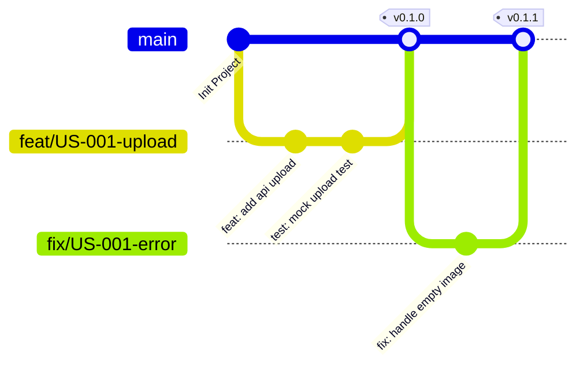

# Quy trình Làm việc với Git (Git Workflow & Collaboration)

Tài liệu này quy chuẩn hóa cách thức làm việc với mã nguồn trong dự án **AI Grading Copilot** để đảm bảo quá trình phát triển song song của 4 lập trình viên không xảy ra xung đột (merge conflicts), code dễ phục hồi và giữ lịch sử git gọn gàng.

---

## 1. Chiến lược Phân nhánh (Branching Strategy)

Hệ thống áp dụng **Trunk-Based Development (TBD)** kết hợp với **Short-Lived Feature Branches** để đẩy nhanh tốc độ release và giảm xung đột code.



* **Nhánh chính (`main`):** Nhánh chứa mã nguồn chạy trên môi trường Production. Mọi commit trực tiếp lên `main` đều bị chặn (Protected Branch).
* **Nhánh tính năng (`feat/...`):** Được tách ra từ `main` để làm các User Story. Vòng đời tối đa của một nhánh tính năng không quá **3 ngày**.
* **Nhánh sửa lỗi (`fix/...`):** Được tách ra để sửa các bug phát hiện trong quá trình test hoặc hotfix trên production.

### Quy tắc đặt tên nhánh:
Format: `[loại_nhánh]/[mã_US_hoặc_mô_tả_ngắn]`
* Ví dụ làm tính năng upload bài: `feat/US-001-upload-paper`
* Ví dụ sửa lỗi OCR tiếng Việt bị mất dấu: `fix/ocr-vietnamese-accents`
* Ví dụ dọn dẹp thư mục: `chore/cleanup-deps`

---

## 2. Quy chuẩn Commit (Conventional Commits)

Để công cụ tự động sinh Changelog và dễ dàng tìm vết lỗi, toàn bộ thành viên bắt buộc phải viết commit message theo tiêu chuẩn **Conventional Commits 1.0.0**:

Format: `<type>(<scope>): <description>`

### Các loại commit (`type`):
* `feat`: Thêm một tính năng mới (ví dụ: `feat(api): add base ocr interface`).
* `fix`: Sửa một lỗi (ví dụ: `fix(frontend): repair zoom button in side-by-side view`).
* `docs`: Thay đổi tài liệu hướng dẫn (ví dụ: `docs(readme): update setup instructions`).
* `style`: Định dạng code (khoảng trắng, dấu chấm phẩy - không đổi logic code).
* `refactor`: Tái cấu trúc mã nguồn nhưng không đổi chức năng hay fix bug.
* `test`: Viết thêm unit test hoặc integration test (ví dụ: `test(ocr): add mock test cases`).
* `chore`: Các tác vụ linh tinh khác (ví dụ: `chore(deps): upgrade fastapi package`).

*Ví dụ commit hợp lệ:*
> `feat(ocr): integrate google cloud vision ocr provider`
>
> `fix(auth): fix token expiration time calculation`

---

## 3. Quy trình Pull Request (PR) & Code Review

Trước khi tích hợp code từ nhánh tính năng vào `main`, lập trình viên bắt buộc phải tạo Pull Request (PR) qua Github/Gitlab và tuân thủ các bước:

```text
[Lập trình viên]          [Hệ thống CI]                [Reviewer]
  Tạo PR mới  ───────> Chạy Lint & Tests ────────> Duyệt & Approve PR
                           │ (Nếu Fail)                 │ (Nếu Pass)
                           └───> Chặn Merge             └───> Merge vào main
```

### 1. Checklist của người tạo PR (Author Checklist):
* [ ] Code đã chạy thử dưới máy local và không bị lỗi.
* [ ] Đã viết Unit Test bao phủ tối thiểu 70% các dòng code mới thêm.
* [ ] Đã chạy linter (`flake8` / `black` cho Python, `eslint` / `prettier` cho Next.js) và không còn cảnh báo lỗi định dạng.
* [ ] Không chứa thông tin mật (API Keys, DB password) trong file config (phải dùng file `.env`).

### 2. Tiêu chuẩn Merge:
* Cần tối thiểu **1 approval** từ thành viên khác trong nhóm.
* Tất cả các bước kiểm tra tự động của CI (Build, Lint, Test) phải đạt trạng thái **PASS**.

---

## 4. Quy chuẩn Định dạng Code (Formatting & Linting)

Cả team sử dụng các công cụ tự động định dạng để tránh tranh cãi về phong cách viết code:

* **Backend (Python):**
  * Định dạng bằng **Black** (`line-length = 88`).
  * Kiểm tra chất lượng bằng **Flake8** (lỗi logic, biến không dùng).
  * Định dạng import bằng **isort**.
* **Frontend (TypeScript/Next.js):**
  * Kiểm tra lỗi bằng **ESLint** (sử dụng luật mặc định của Next.js).
  * Định dạng bằng **Prettier**.

> [!TIP]
> Khuyến khích cài đặt công cụ **Pre-commit hooks** (sử dụng thư viện `husky` cho frontend hoặc `pre-commit` cho backend) để tự động định dạng và linting code ngay tại máy local mỗi khi lập trình viên gõ lệnh `git commit`. Nếu code không sạch, git sẽ từ chối commit.
