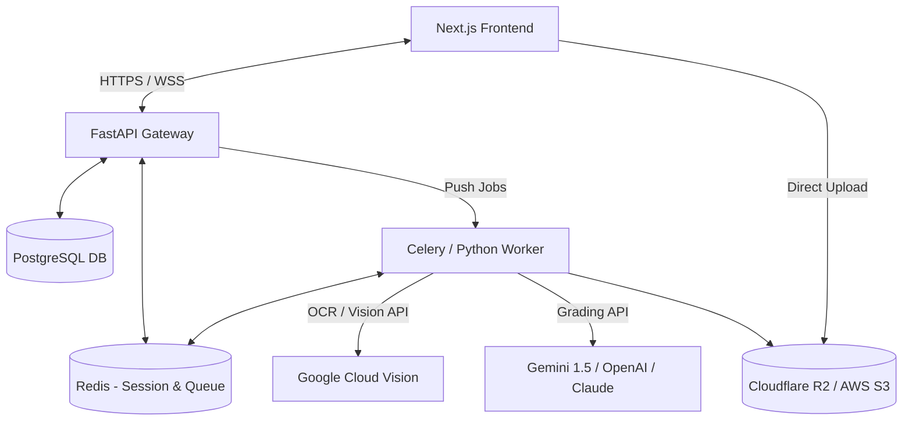
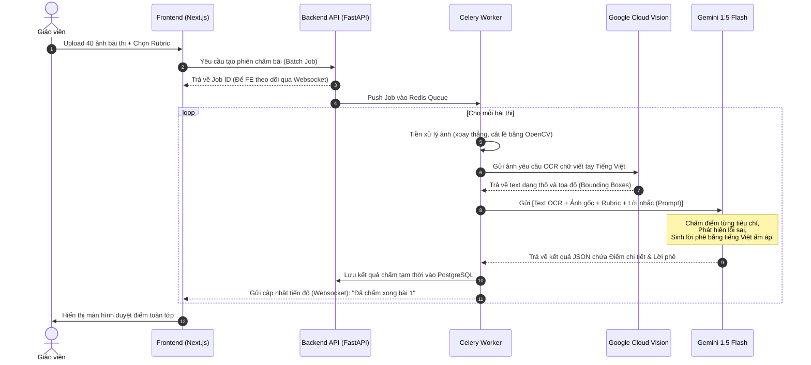
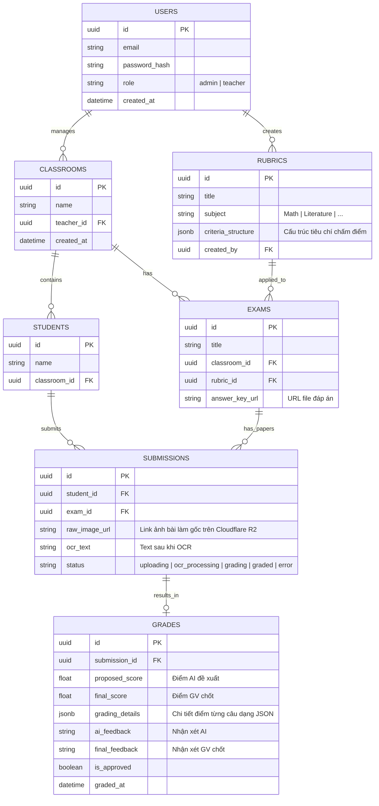

# Đề xuất Tech Stack & Kiến trúc Hệ thống: AI Grading Copilot (Production)

Tài liệu này phân tích chi tiết và đề xuất giải pháp công nghệ (Tech Stack), thiết kế kiến trúc hệ thống và quy trình xử lý AI cho dự án **AI Chấm bài (Grading Copilot)** cấp THCS. Đây là một hệ thống thực tế (Production), cần đảm bảo tính **ổn định, bảo mật dữ liệu học sinh, tối ưu chi phí vận hành AI, và trải nghiệm người dùng mượt mà**.

---

## 1. Phân tích Thách thức Kỹ thuật cốt lõi
1. **Nhận diện chữ viết tay Tiếng Việt (Vietnamese Handwriting OCR):**
   * Học sinh cấp 2 viết tay trên giấy kẻ ô ly hoặc giấy nháp. Chữ viết có độ nghiêng, độ mờ, nét thanh nét đậm khác nhau.
   * Các thư viện OCR mã nguồn mở thông thường (Tesseract, EasyOCR) có tỉ lệ sai số rất cao đối với tiếng Việt viết tay.
   * **Giải pháp:** Sử dụng kết hợp **Google Cloud Vision API** (cho OCR thô có độ chính xác chữ viết tay cực cao) hoặc các mô hình Vision-LLM thế hệ mới như **Gemini 1.5 Flash / GPT-4o** để trực tiếp xử lý text kèm ngữ cảnh bài làm.
2. **Chi phí API AI (LLM Cost) & Giới hạn Tốc độ (Rate Limits):**
   * Chấm một bài thi tự luận Văn/Toán cần gửi đề bài, đáp án, rubric và nội dung bài làm của học sinh cho LLM. Lượng tokens mỗi bài từ 2k - 10k tokens.
   * Nếu giáo viên upload cùng lúc 40-50 bài của cả lớp, hệ thống sẽ bị nghẽn (Rate Limit) và chi phí sẽ rất cao nếu dùng các mô hình đắt tiền như Claude 3.5 Sonnet hoặc GPT-4o.
   * **Giải pháp:** Sử dụng **Gemini 1.5 Flash** cho phần lớn tác vụ OCR + chấm bài thô (chi phí rẻ gấp 10-15 lần GPT-4o, hỗ trợ Context Caching để tiết kiệm chi phí rubric), và chỉ dùng **Claude 3.5 Sonnet** (hoặc GPT-4o) làm "Premium Engine" cho chấm văn nghị luận phức tạp nếu giáo viên yêu cầu độ sâu sắc cao hơn.
3. **Trải nghiệm tương tác thời gian thực (Interactive UX):**
   * Giáo viên cần giao diện tương tác trực quan: Một bên là bài làm gốc (ảnh/PDF), một bên là văn bản OCR được highlight lỗi sai kèm nhận xét của AI.
   * Giáo viên phải chỉnh sửa trực tiếp được điểm số và lời phê (Human-in-the-loop).
4. **Xử lý bất đồng bộ (Asynchronous Background Processing):**
   * Quá trình tải lên 40 file ảnh, tiền xử lý ảnh (xoay góc, làm nét), gọi API OCR, chấm điểm bằng AI có thể mất từ 1 đến 3 phút cho toàn bộ lớp học.
   * Không thể bắt giáo viên giữ kết nối HTTP chờ phản hồi (dễ bị timeout). Hệ thống bắt buộc phải sử dụng kiến trúc **Job Queue** bất đồng bộ.

---

## 2. Đề xuất Tech Stack (Production-ready)

Dựa trên yêu cầu và thách thức trên, dưới đây là stack tối ưu nhất về hiệu năng, chi phí vận hành, tốc độ phát triển và khả năng tuyển dụng nhân sự tại Việt Nam.

### Chi tiết các thành phần:

| Thành phần | Công nghệ Đề xuất | Lý do Lựa chọn |
| :--- | :--- | :--- |
| **Frontend** | **Next.js (React) + TypeScript + TailwindCSS** | • Tạo giao diện Dashboard mượt mà, hỗ trợ tốt quản lý trạng thái phức tạp (tương tác ảnh, chấm điểm side-by-side). • Dễ dàng tích hợp các thư viện UI chất lượng cao (ShadcnUI, Radix). • Cộng đồng lập trình viên React tại Việt Nam cực kỳ lớn. |
| **Backend API**| **FastAPI (Python)** | • Tối ưu nhất cho các ứng dụng tích hợp AI/LLMs vì toàn bộ hệ sinh thái AI (LangChain, LlamaIndex, Pydantic, OpenCV) đều viết bằng Python. • Tốc độ thực thi cực nhanh (sử dụng async/await), tự động sinh tài liệu API (Swagger). |
| **Background Worker** | **Celery + Redis** | • Giải quyết bài toán xử lý bất đồng bộ khi giáo viên upload hàng loạt bài thi. • Celery tự động phân phối tác vụ cho các worker xử lý ảnh và gọi API LLM mà không làm nghẽn API chính. |
| **Database** | **PostgreSQL** | • Lưu trữ dữ liệu quan hệ chặt chẽ: Trường -> Lớp học -> Học sinh -> Kỳ thi -> Bài làm -> Chi tiết điểm thi. • Hỗ trợ kiểu dữ liệu `JSONB` rất tốt để lưu các cấu trúc Rubric linh hoạt (mỗi môn, mỗi khối lớp có một kiểu rubric khác nhau). |
| **Storage** | **Cloudflare R2** (hoặc AWS S3) | • Lưu trữ ảnh chụp bài thi của học sinh. • Cloudflare R2 **miễn phí hoàn toàn chi phí băng thông tải xuống (Egress fees)**, giúp tiết kiệm cực kỳ nhiều chi phí khi giáo viên liên tục xem lại ảnh bài thi cũ. |
| **Realtime** | **WebSockets (FastAPI)** hoặc **SSE** | • Đẩy cập nhật tiến độ chấm bài theo thời gian thực (ví dụ: *"Đang OCR bài 5/40..."*, *"Đang chấm bài 12/40..."*) lên giao diện giáo viên. |

---

## 3. Kiến trúc Luồng Xử lý AI & OCR (AI Pipeline)

Để tối ưu hóa độ chính xác nhận diện và chi phí API, luồng xử lý bài làm của học sinh sẽ trải qua 4 bước:

### Chiến lược tối ưu hóa chi phí AI trong Production:
1. **Gemini 1.5 Flash Context Caching:**
   * Khi chấm cả lớp (40 học sinh) cùng một đề bài và rubric, phần đề thi và rubric (có thể nặng hàng chục KB) là giống nhau hoàn toàn.
   * Gemini 1.5 hỗ trợ **Context Caching**. Hệ thống sẽ cache Rubric này trên máy chủ của Google. Các request chấm bài tiếp theo chỉ cần truyền bài làm của học sinh và trỏ đến cache ID, giúp **giảm tới 75% chi phí token đầu vào**.
2. **Double-Engine Strategy (Lựa chọn động):**
   * **Môn Toán/Lý/Hóa:** Dùng Gemini 1.5 Flash là đủ tốt để phát hiện lỗi tính toán và so khớp kết quả.
   * **Môn Văn/Anh:** Đối với các bài viết dài cần độ cảm thụ văn học cao, hệ thống cho phép giáo viên chọn chế độ "Chấm chuyên sâu" sử dụng **Claude 3.5 Sonnet** (sẽ tốn nhiều credit hơn).

---

## 4. Thiết kế Cơ sở Dữ liệu sơ bộ (Database Schema Draft)

Dưới đây là các bảng dữ liệu chính để quản trị hệ thống:

---

## 5. Kế hoạch Hạ tầng & Triển khai (Infrastructure & DevOps)

Để tối thiểu chi phí ban đầu nhưng vẫn đảm bảo khả năng mở rộng (Scale):

* **Môi trường Deploy ứng dụng:**
  * **Frontend (Next.js):** Deploy trực tiếp lên **Vercel** hoặc **Cloudflare Pages** (Bản Free/Pro ban đầu rất rẻ, băng thông lớn, CDN toàn cầu tốt).
  * **Backend (FastAPI, Celery Worker, PostgreSQL, Redis):** Đóng gói bằng Docker. Deploy lên cụm Server VPS riêng (ví dụ: Hetzner hoặc các nhà cung cấp nội địa như Viettel IDC, VNG Cloud để giảm độ trễ về Việt Nam). Nên sử dụng dịch vụ DB Managed (như Supabase hoặc Neon) để tránh việc tự vận hành database và backup.
* **Bảo mật & Quyền riêng tư (GDPR/Student Data Privacy):**
  * Che mờ (anonymize) tên học sinh trên bài làm trước khi gửi qua API của bên thứ ba nếu có chính sách bảo mật nghiêm ngặt.
  * Toàn bộ ảnh bài làm phải được lưu trong bucket Cloudflare R2 có cấu hình **Presigned URLs** (chỉ cho phép truy cập có thời hạn, không public công khai).

---

## 6. Đánh giá rủi ro & Giải pháp phòng ngừa

1. **Rủi ro OCR sai lệch dẫn đến chấm điểm sai:**
   * *Phòng ngừa:* UX thiết kế nút bấm "Sửa OCR" trực quan ngay cạnh ảnh gốc. AI sẽ chỉ chấm dựa trên văn bản đã được giáo viên xác nhận hoặc tự động chấm nhưng có cảnh báo độ tin cậy thấp (Confidence Score < 85%) để giáo viên lưu ý kiểm tra kỹ.
2. **Học sinh dùng chữ viết quá cẩu thả/mờ:**
   * *Phòng ngừa:* Module tiền xử lý ảnh sử dụng thuật toán làm sắc nét và tăng độ tương phản (Contrast enhancement). Nếu độ tin cậy của OCR quá thấp, hệ thống sẽ gán trạng thái `error` kèm cảnh báo giáo viên chấm thủ công hoặc chụp lại bài.
3. **Mất kết nối mạng giữa chừng:**
   * *Phòng ngừa:* Vì toàn bộ tiến trình chấm chạy ở Celery Worker dưới DB, giáo viên có thể tắt trình duyệt đi ngủ. Khi mở lại, hệ thống sẽ đồng bộ lại trạng thái từ DB và hiển thị kết quả chấm xong.
